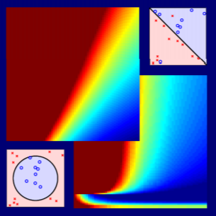

# Machine Learning Foundations 2020 Fall

  

## instructed by Hsuan-Tien Lin
* [Course website](https://www.csie.ntu.edu.tw/~htlin/course/ml20fall/)

It's historical homework record in ML Foundations and ML Techniques.
Feel free to discuss with me if you have any questions in my answers. 
